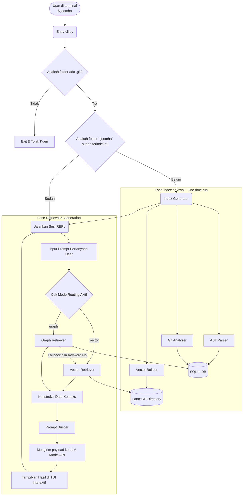

# Arsitektur Sistem JOOMHA (AI CLI Code Comprehension Tool)

## Perencanaan Sistem
Joomha dirancang sebagai CLI (Command Line Interface) berbasis Python yang dapat memahami repositori kode asing dan menjawab pertanyaan pengguna dalam bahasa natural. Perencanaan sistem berfokus pada dua dimensi utama: sebagai produk yang dapat didistribusikan secara publik (via PyPI), dan sebagai instrumen penelitian skripsi untuk mengevaluasi dan membandingkan efektivitas metode **Vector-Based Retrieval** vs **Graph-Based Retrieval** dalam memahami basis kode. 

Dengan menginstal `joomha` dan menjalankannya di dalam root repositori, alat ini melakukan pengindeksan data secara lokal melalui Parsing AST dan analisis riwayat Git, serta memotong (chunk) file untuk membuat embeddings. Melalui dua pendekatan mesin pencari tersebt, teks dikumpulkan dan diserahkan ke komponen Orchestrator untuk kemudian dihubungkan ke penyedia Language Model (LLM) sesuai BYOK (Bring Your Own Key) demi menjamin privasi dan skala komputasi yang serba-lokal kecuali proses LLM Generation.

---

## 1. Stack Teknologi & Filosofi Pilihan

Sistem menggunakan stack yang mengedepankan performa lokal (zero-dependency-database-server).
- **Bahasa**: Python 3.10+
- **CLI Framework**: Typer (deklarasi perintah yang bersih & parsing argumen berdasar type hints)
- **TUI Display**: Rich (tampilan terminal lebih rapi untuk warna dan tabel)
- **Input Handler**: Prompt Toolkit (autocompletion, riwayat input kueri)
- **AST Parser**: `ast` bawaan Python (mengekstrak relasi fungsi, kelas, dan dependencies/imports)
- **Git Analyzer**: GitPython (baca riwayat, frekuensi *hotspots*, *co-changes* file)
- **Vector DB**: LanceDB (sepenuhnya lokal, simpan dalam direktori, sangat cepat untuk data kode menengah)
- **Embedding Model**: `all-MiniLM-L6-v2` via `sentence-transformers` (ringan 22MB, offline setelah instal)
- **Relational/Graph DB**: SQLite Bawaan (mencatat nodes, edges dan relasi untuk graf dengan recursive CTE query)
- **LLM Integration**: Google Generative AI / OpenAI / Anthropic (BYOK model selection)
- **Metrik Evaluasi**: RAGAS (khusus untuk keperluan riset, membandingkan performa RAG: Vector vs Graph)

---

## 2. Struktur Modul & Arsitektur Direktori

Sistem dibagi menjadi modul independen mengikuti pola *Separation of Concerns* (Pemisahan Tanggung Jawab).

```text
joomha/
├── cli.py                  # CLI Entry point & loop interaktif utama (REPL)
├── config.py               # Pengaturan konfigurasi, manajemen API key BYOK
├── orchestrator.py         # Otak penghubung Retriever, Prompting, LLM, dan UI
├── indexer/                # Mesin Pengindeks / Pembangun Konteks
│   ├── ast_parser.py       # Pemetaan AST ke SQLite (Tabel Nodes & Edges relasional)
│   ├── git_analyzer.py     # Analisis komit ke SQLite (Hotspots, Co-changes correlation)
│   └── vector_builder.py   # Pemotongan teks (Chunking), embedding, simpan ke LanceDB
├── retriever/              # Mesin Mesin Pencari Konteks Semantik & Relasional
│   ├── vector.py           # Pencarian Vector jarak kedekatan cosinus (Cosine Similarity)
│   └── graph.py            # Pencarian relasi dependensi di SQLite (Recursive CTE)
├── llm/                    # Generasi LLM
│   ├── client.py           # Abstraksi koneksi REST untuk model AI 
│   └── prompt_builder.py   # Pembangun prompt yang menyatukan source code agar LLM mengerti
└── ui/                     # Manajemen Antarmuka TUI 
    ├── display.py          # Render informasi menggunakan library Rich
    └── input_handler.py    # Menangani interaksi dan tangkap masukan dari user
```

---

## 3. Desain Mesin (Engine Design)

Inti dari aplikasi dipisahkan ke fase awal komputasi dan aliran waktu-operasional.

### 3.1 Fase Indexing (Dilakukan sekali saat eksekusi pertama pada root folder saat Joomha diaktifkan)
1. **Analisis Struktur Ast**: `ast_parser.py` menelusuri file `.py` untuk membentuk Node (file, fungsi, modul, kelas) dan Edge (imports, pemanggilan fungsi). Di simpan ke tabel SQLite lokal dalam folder index.
2. **Analisis Histori Git**: `git_analyzer.py` menelusuri log `.git`. Menganalisis file apa yang berubah berbarengan melintasi komit (*co-change* partner) dan file mana yang intens diubah (*hotspot*). Disimpan di sekuel tabel histori SQLite.
3. **Penyimpanan Vektor**: `vector_builder.py` memecah semua file kode (Chunking) ke dalam ukuran statis (contoh: 40 baris optimal, dengan 10 baris overlap agar block code tak terputus logicnya). Terjemahkan ke vektor via embedder kemudian simpan di format column LanceDB.

### 3.2 Fase Retrieval (Dijalankan per instruksi/kueri natural dari pengguna)
Sisa waktu pengguna akan dihabiskan untuk berinteraksi di tahap ini.
*   **Vector Engine**: Mem-vektorisasi pertanyaan pengguna dan mencarinya di LanceDB via jarak dekat cosinus, sistem akan mendapatkan 5 (Top-K) potongan kode utuh paling berhubungan secara maknawi.
*   **Graph Engine**: Mengekstrak kata kunci dan mencari simpul / *Node* target di SQLite. Kemudian Engine ini memetakan relasi simpul *co-change* (file sejarah apa saja yang selalu bersinggungan di git log). Bila terjadi kebuntuan relasi, Engine dirancang untuk **Fallback / beralih otomatis** ke Vector retrieval.

### 3.3 Fase Generasi (Orkestrasi)
1. **Prompt Builder**: Mengkombinasikan konteks kembalian *Retrieve*, system prompt instruksi QA kode, dan Kueri User. *Prompt pattern* dirancang sama identik guna menjaga eksperimen skripsi valid dan terisolasi dari bias LLM.
2. **LLM API**: LLM menganalisis pola *chunk* / relasi *graph* kemudian merangkai output instruksi dalam balutan Markdown menuju Terminal Rich CLI.

---

## 4. Workflow Flowchart Execution



---

## 5. Sistem Skrip Evaluasi (Khusus Riset Skripsi - Batch Evaluating)
Diluar modul CLI standar (`joomha`), disertakan root file mandiri `evaluate.py`. Berkas ini adalah jantung instrumen validitas dari komparasi skripsi.
1. Membaca batch dataset 30 (atau lebih) sampel pertanyaan & *ground truth* (contoh dari `test_questions.json`).
2. Menyuplai tiap pertanyaan berturut-turut pada dua mesin *Vector* dan *Graph*.
3. Menganalisis via framework **RAGAS Evaluator** terhadap respon LLM.
4. Menghasilkan dump kalkulasi Metrik (*Faithfulness*, *Answer Relevance*, *Context Precision*, *MRR*, *Hit Rate*, *Latency*) di dalam laporan akhir `hasil_evaluasi.csv`.
